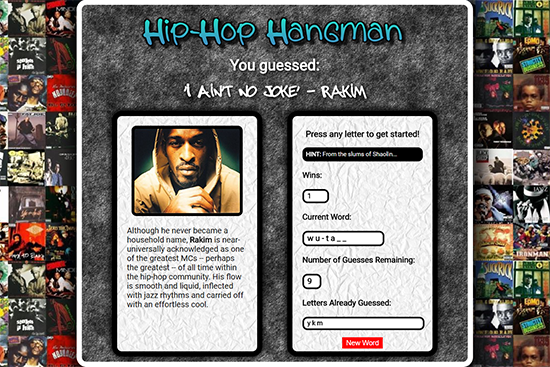

# Javascript "Hip-Hop Hangman" Game

 [View Live!](https://bereznd1.github.io/Hip-Hop-Hangman/) 

## Brief Description

The **Javascript Hangman Game** allows users to type in letters in order to guess a randomly chosen Hip-Hop artist from an array of predefined choices. If the user types in a letter that is in the current artist's name that is being solved, that letter gets filled in at the appropriate spot within the blank word. When the user fills out an entire word correctly, an image of the artist appears on the left side of the screen, and one of the artist's songs starts playing, with the title of the song being displayed at the top of the screen.

## How This Was Achieved

First, I made a Javascript array of 10 rappers & also created a variable that picks out a random rapper from this array.  In addition, I created a variable to track the amount of **wins** (when the user fills out all the letters in an artist's name), as well as the amount of **guesses remaining** for the user to complete the word. When the body of the page is loaded, Javascript runs a loop that generates underscores for each letter in the current randomly chosen artist's name, and puts these underscores in the *current word* div. 

Next, Javascript registers what key the user has pressed and stores this inside a variable. It runs a loop which which checks if the letter the user typed is part of the current word, and if so, it fills in that letter at the appropriate spot within the artist's name. If the letter the user presses is NOT within the current word, and also if it has not already been pressed, then that letter goes in the *letters already guessed* div & the amount of **guesses remaining** goes down by 1. 

When an entire word is filled out, Javascript adds 1 point to the **wins** variable and displays the score on the page, generates a new random word and fills out the *current word* div with underscores based on how many letters are in that word, the amount of **guesses remaining** goes back to its original number (12), the *letters already guessed div* is cleared out, and, based on what specific artist was just guessed, that artist's picture & bio is loaded into the left div. One of the artist's songs begins playing in the background & the title of the song and the artist is also displayed above the main gameplay section.

If a user runs out of guesses before filling out the current word, another word is generated, the amount of **guesses remaining** is reset to 12, and the *letters already guessed* div is cleared out. 

There is also a button called *New Word* that allows a new word to be picked and the guessing statistics to be reset. 

Finally, every time a new artist word is generated for the user to guess, whether on page load, after a win, after a loss, or after a reset, a different *hint* is displayed based on the current artist to make the process easier for users, since the amount of possible rappers is way too huge to narrow down just based on the number of letters in their names. 